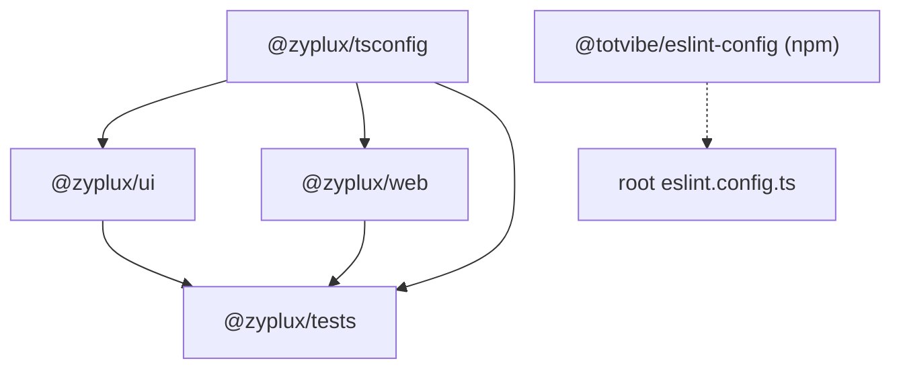

# Monorepo Setup

**Stack:** Bun workspaces + TypeScript project references + ESLint (Flat Config, published `@totvibe/eslint-config`)

## Package Structure

_How do the workspace packages depend on each other?_



- `apps/web` — Vite + React app deployed to Cloudflare
- `packages/ui` — shared utilities (`cn`)
- `packages/tsconfig` — shared TypeScript presets (`base.json`, `bun.json`, `web.json`)
- `tests` — smoke tests against public package interfaces only (`fixtures/` + `stories/` + happy-dom web harness)

## TypeScript Configuration

- Root `tsconfig.json` is a solution file (`files: []` + `references`); `bun run typecheck` runs `tsc -b`.
- `tsconfig.tooling.json` covers root config files (`eslint.config.ts`, `prettier.config.ts`).
- Every project extends a `@zyplux/tsconfig` preset: composite, `emitDeclarationOnly` into `.tsbuild/`.
- `apps/web/tsconfig.node.json` typechecks `vite.config.ts` separately from app sources.

## ESLint Configuration

Single root `eslint.config.ts` consumes the published [`@totvibe/eslint-config`](https://github.com/realSergiy/totvibe-eslint):

```typescript
export default defineConfig(...totvibe({ react: true, tsconfigRootDir: import.meta.dirname, ignores: ['**/.tsbuild/**'] }));
```

It bundles ESLint recommended, typescript-eslint strict + stylistic (type-aware via `projectService`), React + hooks, perfectionist, unicorn, custom `@totvibe/*` rules, and prettier compatibility.

## Dependency Management

Version ranges are centralized in the `workspaces.catalog` of the root `package.json`; packages reference them as `"catalog:"`. Workspace packages use `workspace:*`.

Upgrades run through `npm-check-updates` (catalog-aware):

```bash
just upgrade              # report/apply upgrades
just upgrade-interactive  # pick upgrades, then reinstall
```

## Common Tasks

```bash
just            # list all recipes
just check      # full gate: install, knip, typecheck, lint, test
just dev        # Vite dev server
just build      # vite build → apps/web/dist
just deploy     # build + wrangler deploy
```
