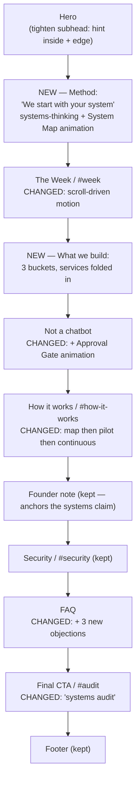
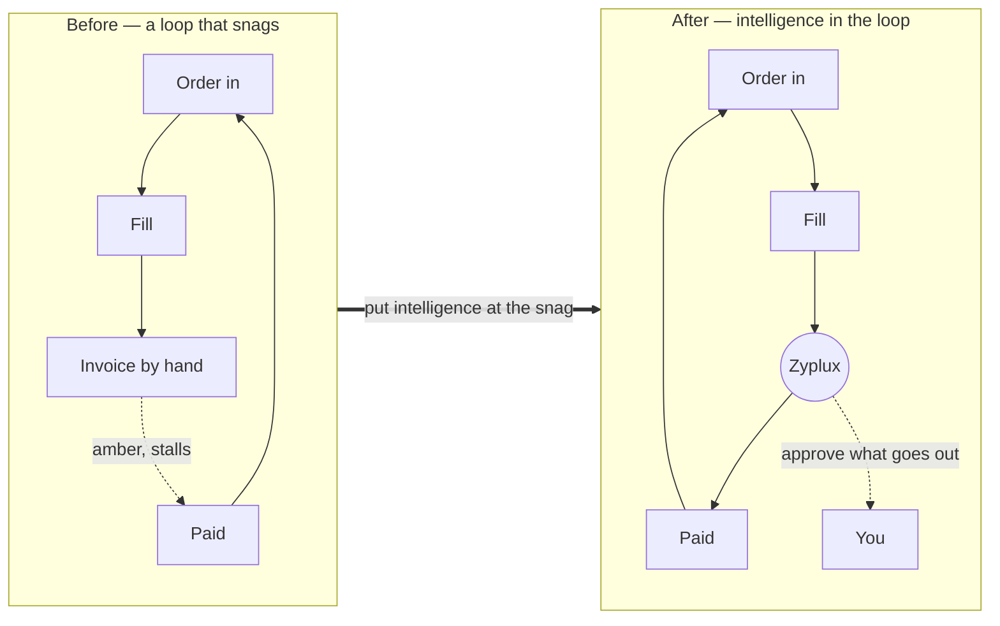

# Messaging & service expansion proposal

Status: implemented (2026-06-10). Direction B (systems-thinking practice) chosen and built:
the Method and What-we-build sections, the System Map and Ask→Dashboard animations, the
animated timeline and hero ambient, the copy and FAQ additions, the audit reframe, and the
edge security note all shipped. Deferred (documented below): the standalone Approval Gate
animation (the System Map and the copy already carry the approval message) and the `/agent`
live showcase (a separate, larger track that depends on the totvibe-agent embed).

Scope: how to expand the home-page content from "a private AI agent that does back-office
work" to a systems-thinking practice that deploys agents, dashboards, and customer-facing
software — without diluting the sharp positioning the site has today.

Honors the copy rules in `docs/old/post-new-content.md`: brand is **Zyplux** (never
"Zyplux.ai"); banned words _agentic, LLM, orchestration, model, prompt, leverage,
transformative_ (sole exception: "never trains public AI models"); outcome over
technology; no invented numbers; every claim true of the product.

## Where the site stands today

The page is sharp. One message, told well: a private AI agent that does the repetitive,
multi-step back-office work end to end, with a human approving anything that leaves the
building. Plain, outcome-led voice; the "week with Zyplux" vignettes make it concrete; the
founder note and security section carry the trust. The design system (parallax grid,
scroll reveals, spotlight cards, shimmer wordmark, full `prefers-reduced-motion` support)
is restrained and good.

## The one strategic call to make first

The candidate service list points two directions, and which one wins changes everything
downstream:

- **Direction A — generalist build shop:** "we build mobile apps, registration pages,
  chatbots, web apps, integrations, dashboards." A commodity. Every agency says it. It
  dilutes what makes the current site good and competes on price and hours.
- **Direction B — systems-thinking practice that happens to build:** "we map your business
  as a system, find the few places where a small change pays back the most, and put
  intelligence exactly there — sometimes an automated loop, sometimes a dashboard,
  sometimes an app your customers touch." The build is the instrument, never the headline.

**Recommendation: B, and it's not close.** B is the only direction consistent with (a) the
existing positioning, (b) founder credibility — twenty years of systems, a pricing engine,
a logistics platform — and (c) the founder's own framing: think in systems, fall in love
with the problem, walk backward to the technology. That sequence is the product. The seven
services are just what gets deployed at the end of it.

Everything below assumes B. Do not bolt a flat "Services" list onto the page; reframe the
services as the toolkit of a systems practice.

## The founder's own ideas already map to this

`docs/old/roadmap.md` lists three phrases to explain. They line up with a clean taxonomy:

| Phrase                | What it is                                                | Bucket                   |
| --------------------- | --------------------------------------------------------- | ------------------------ |
| **close the loop**    | automate a feedback loop to autonomy, with approval gates | Close the loop           |
| **hallucinate ui**    | ask a question, get a dashboard built from your data      | Light up the system      |
| **continuous zyplux** | the ongoing run-tune-expand relationship                  | the _how it works_ spine |

Retire "hallucinate ui" as a public term (negative AI baggage; "prompt"/"hallucinate" are
off-limits) but keep the capability — reframed as "ask a question in plain language, get a
view."

## Service taxonomy — three places intelligence pays back

The seven candidate services collapse into three buckets, each led by an outcome, with a
clean inside-vs-edge split.

| Bucket                                    | What it is                                                                   | Services folded in                                                                | Outcome line                                                     |
| ----------------------------------------- | ---------------------------------------------------------------------------- | --------------------------------------------------------------------------------- | ---------------------------------------------------------------- |
| **Close the loop** _(inside)_             | the repetitive multi-step work, run end-to-end, human approves what goes out | feedback-loop automation w/ approval gates · API integrations to existing systems | "Hours back. Loops that, over time, run themselves."             |
| **Light up the system** _(inside)_        | ask in plain language, get a dashboard assembled from your own data          | dashboards on the fly                                                             | "Answers in seconds, not a ticket to the data team."             |
| **Build at the edge** _(customer-facing)_ | the software your customers actually touch, shipped fast                     | mobile apps · registration pages · website assistants · web apps                  | "Reach your customers better — and ship in weeks, not quarters." |

The inside-vs-edge frame is the real expansion of the narrative: today the site only sells
inside (saving the client hours). Adding edge says Zyplux also helps the client grow by
serving their own customers better — same method either way. Bigger story, still coherent.

## Revised page structure

_The proposed home-page section flow — NEW and CHANGED marked._

Two genuinely new sections (Method, What we build), three light upgrades, everything else
kept. Deep service detail can later live on a `/work` subpage (consistent with the existing
`/agent`, `/insights`, `/privacy` multi-input pattern) so the home page stays scannable.

## Draft copy for the new sections

All in the existing voice, banned-words-clean. These slot into `apps/web/src/content.ts`
as new exports.

### Method section — "We start with your system, not our software"

> **We start with your system, not our software.**
>
> Every business is a set of loops. An order comes in, it's filled, invoiced, paid — and
> the cash funds the next order. A customer asks, gets an answer, comes back. When a loop
> runs clean, the business grows. When it snags — a step done by hand, a hand-off that
> drops things, a report nobody has time to read — the whole system slows, and you feel it
> as lost hours and missed money.
>
> So before we build anything, we learn your loops. We sit with how the work actually
> happens — not the org chart, the real flow — and find the few places where a small change
> pays back the most. Then we put intelligence exactly there.
>
> That's the order we work in: understand the system, fall for the problem, then walk back
> to the technology. The software is the last decision, not the first.

Three beats (cards):

1. **Map the loops.** — "We trace how work, money, and information move through your
   business — and where they stall."
2. **Find the pressure points.** — "The handful of spots where one change returns the most
   hours, the most cash, at the least risk."
3. **Put intelligence there.** — "An agent, a dashboard, or an app your customers touch —
   whatever the spot actually needs. Built around your loop, not bolted on."

### What-we-build section — "Three places intelligence pays back"

> **Three places intelligence pays back.**
>
> Once we know your loops, the build is the easy part. It lands in one of three places —
> sometimes all three.

- **Close the loop.** "The repetitive, multi-step work that fills your team's week —
  handled end to end, with a human approving anything that leaves the building. We connect
  the email, spreadsheets, and tools you already pay for, and tune the loop until it runs
  on its own — with you watching, not driving."
- **Light up the system.** "Ask a question in plain language — _how did the north region do
  last quarter?_ — and get a dashboard built from your own data, on the spot. Answers in
  seconds, not a ticket to the data team."
- **Build at the edge.** "The software your customers actually touch — a registration page,
  a booking flow, a mobile app, a website assistant that answers like your best rep. Built
  fast, because an agent carries the load."

### Three new FAQ items

- **"We already have developers — are you just an agency?"** — "Not in the usual sense. We
  don't take a spec and bill hours. We find the loop where intelligence pays back, build
  the smallest thing that proves it, and tune it until it runs. This is usually the work
  that keeps getting pushed to next quarter."
- **"Can this help us serve our own customers, not just our back office?"** — "Yes. The
  same method builds the things your customers touch — a registration page, a booking flow,
  a mobile app, a website assistant. Inside your operations or at the edge with your
  customers, the approach is identical: find the loop, build for it."
- **"What's a 'dashboard from a question'?"** — "Ask in plain language — _show me last
  quarter's refunds by region_ — and a view is assembled from your own data while you wait.
  No ticket, no waiting on the data team. You decide what's worth keeping."

### Audit reframe

Elevate "free workflow audit" to **"free systems audit"**: "You get back a map of your
loops, the three places intelligence pays back fastest — ranked by the hours and cash
they'd return — and a plan to build the first one. No call required." Note: "workflow
audit" is referenced in `tests/` fixtures, so this rename touches `content.ts` + tests.

## Animation concepts — the visual aides

All achievable in the current stack (Motion v12 `useScroll`/`useTransform`/`useInView`,
SVG `motion.path` with `pathLength`, `useMotionValue` + `animate` for counters) — no heavy
3D needed, each with a static reduced-motion fallback. Each reuses the existing primitives
(`Reveal`, `Pictogram`, `SpotlightCard`, the parallax `GridBackground`).

1. **The System Map** _(centerpiece — Method section)._ A node graph of a business (Sales,
   Inventory, Support, Finance, Customer) with edges that form loops. On scroll-in the
   edges draw themselves (`motion.path` `pathLength` 0 to 1). One loop pulses amber — "hours
   leak here." Then a Zyplux node slots into that loop; it turns green and a dash-flow
   animates along the path — the loop now runs. This animation is "thinking in systems"
   made visible.
2. **The Approval Gate** _(Not-a-chatbot or Security section)._ An envelope travels a path
   toward "Customer," hits a closed gate, a cursor clicks Approve, the gate opens, the
   envelope continues; loops. Makes "nothing goes out without your approval" visceral
   instead of a bullet point.
3. **Ask then Dashboard** _(Light up the system)._ A question types itself out ("How did
   the north region do last quarter?"), then charts assemble from nothing below it — bars
   grow, a sparkline draws via `pathLength`, a KPI counts up with `useMotionValue`.
   Scripted and deterministic (clearly a scenario, never implying live generation — keeps
   the claims-true rule intact).
4. **The Week, animated** _(upgrade to existing `vignette-timeline.tsx`)._ Today it's a
   static reveal list. Make the left border a scroll-driven progress line (`useScroll` on
   the section, `scaleY` via `useTransform`) that travels down the week; each scene's dot
   lights and its green check chip stamps in as the line passes. Small change, big polish.
5. **Inside / Edge** _(What-we-build header)._ A concentric/split visual: an inner ring
   "your operations" with loops closing, an outer ring "your customers" with app tiles
   appearing — Zyplux pulsing in both. Sells the two-surface story at a glance.
6. **Hero ambient (restrained).** Keep the shimmer wordmark; add a faint pulse traveling
   along the grid lines and 2-3 slow-drifting accent particles. Subtle — the hero shouldn't
   compete with the System Map.

_What the System Map animation depicts._

Guardrails for all of them: every animation needs a meaningful static end-state for
`prefers-reduced-motion`; decorative SVG gets `aria-hidden` with real text underneath;
prefer SVG/CSS transforms over canvas/3D; scenario animations stay labeled as scenarios,
never as live product output.

## Further improvements (beyond the candidate list)

1. **Prioritize the `/agent` showcase above all of this.** Already on the roadmap, and the
   single biggest trust lever — a real session showing the agent read, check, draft, and
   stop for approval, with the audit log visible. Case studies are barred by the rules, so
   a live demo is the proof everything else only claims. Build this before expanding the
   marketing copy.
2. **Put a unit on every outcome.** Each bucket card should carry the unit it moves (hours
   returned, response time, time-to-ship) — as honest scenario framing, no invented client
   numbers.
3. **Progressive disclosure, not a longer page.** Home gets the tight 3-bucket summary; a
   `/work` subpage holds depth. The one-pager's focus is its strength.
4. **The edge expansion needs a security note.** Customer-facing software touches the
   client's customers' data. The current Security section is framed around the client's
   internal systems. Selling "build at the edge" means adding a line covering data handling
   for end-users, or the strongest objection goes unanswered.
5. **Tie the Insights articles to the new buckets.** The roadmapped "what an agent does all
   day" maps to Close the loop; a new "ask your data a question" piece maps to Light up the
   system. Content marketing that mirrors the taxonomy.

## How to proceed

Recommended sequence, with tradeoffs:

1. **Lock the positioning (B) and the copy** — cheapest, highest leverage, unblocks
   everything else. (Do first.)
2. **Implement the two new sections + copy in `content.ts`** — visible value, low risk,
   follows existing component patterns.
3. **Build the signature animations** — highest wow, highest effort; the System Map (#1)
   and animated Week (#4) give the best ratio.
4. **`/agent` showcase** — separate, larger track, but the real trust win.

Copy-first is the recommendation: the animations should illustrate locked messaging, not
the reverse.
